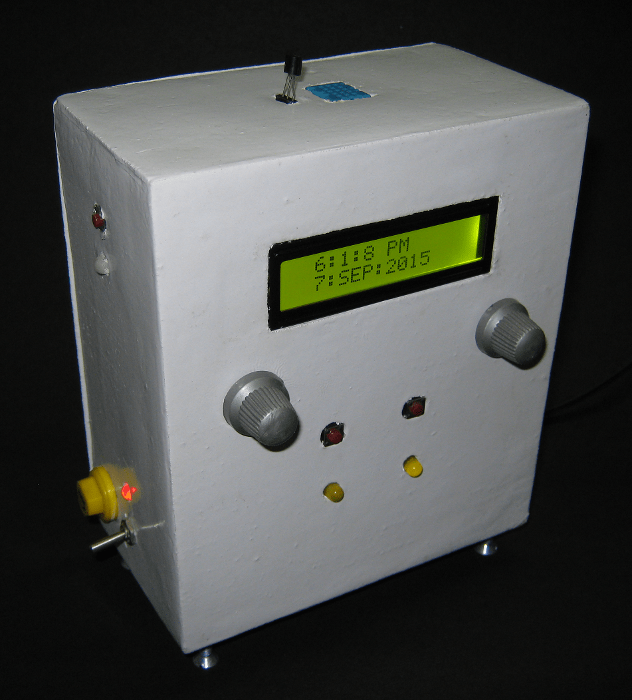
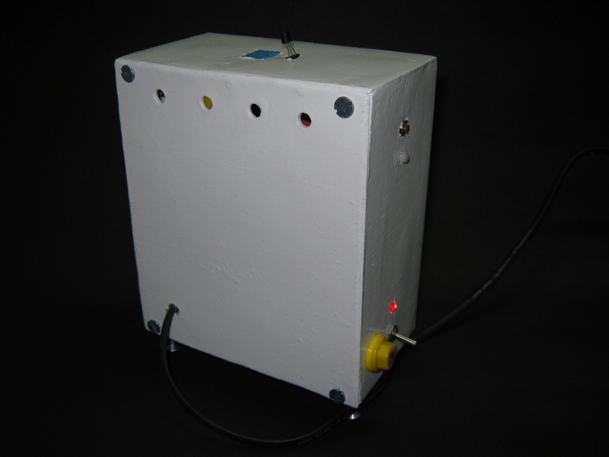
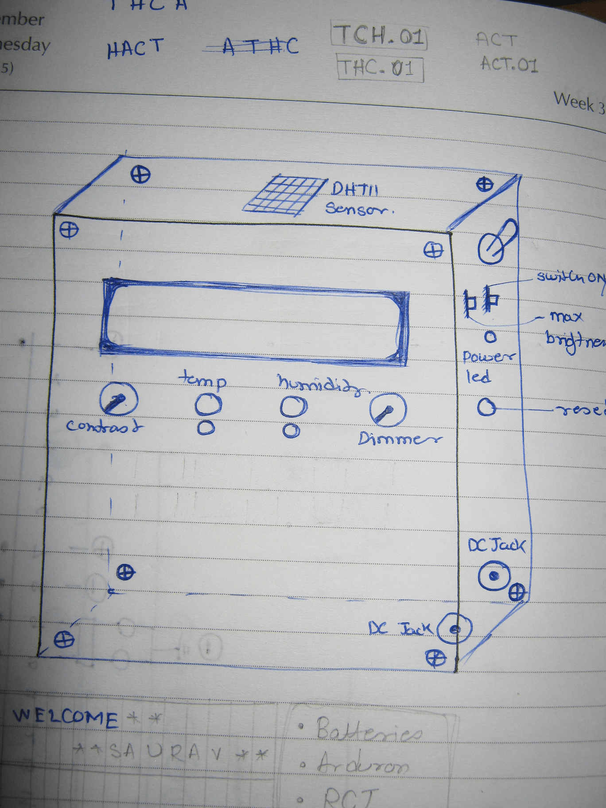
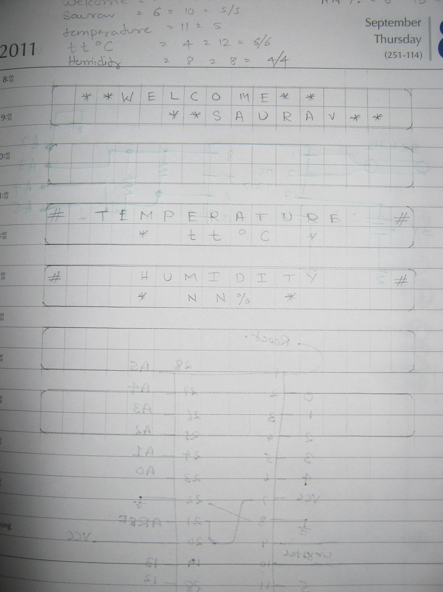
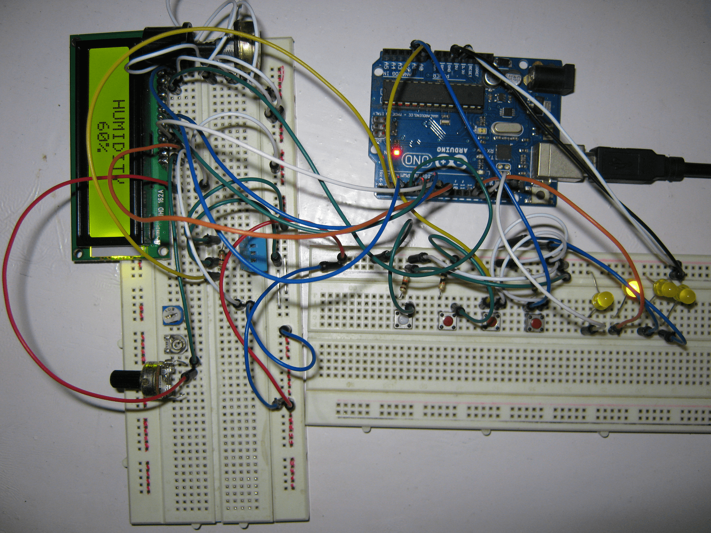
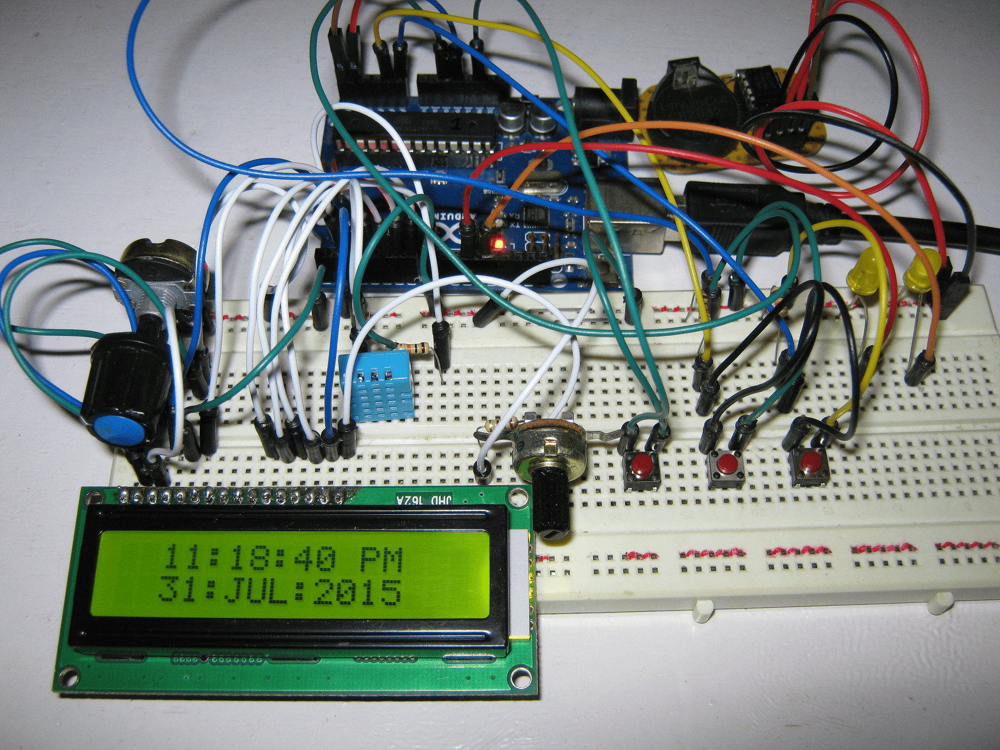

# Digital-Clock-Temperature-Humidity-Meter

<ul>
  <li>Here in this porject I designed and produced a clock that can show the date, month, year, time, temperature, and humidity.</li>
  <li>I used and earned and designed using code written in C/C++ coded in Arduino IDE, using hardware such as ATMEGA328 as the primary IC, RTC DS3231 for clocking, Sensors DHT11 for humidity sensing, LM35 and my tempaerature sensor, and Voltage Regulator 7805.</li>
  <li>For the final build used Eagle CAD Software and Fritzing for PCB design.</li>
  <li>Designed wooden casing/enclosure for final presentation in AutoCAD for a completed end-user product, which I personally used as my desk clock and climate monitor</li>
</ul>  
  
## How the final desk clock looks :) 

### Idea for the project

Once, in one of my classes at university, I was doodeling and thought about a desk clock which can show me also the ambient temperature and humiduty, then I started imaging the design and started making addidtions to the idea profressively. 

and thought about the interface and other additions I can make to it. 

### Breadboard Prototype! 

So, like with every project, I started out making the project or prototyping it on the breadboard and everythihg seemed to work fine. 

---

you can also see the working here [Video of working prototype](videos/prototype1.AVI "Video of working prototype")

## Now, the hard part! 
Transferring the breadboard circuit 

